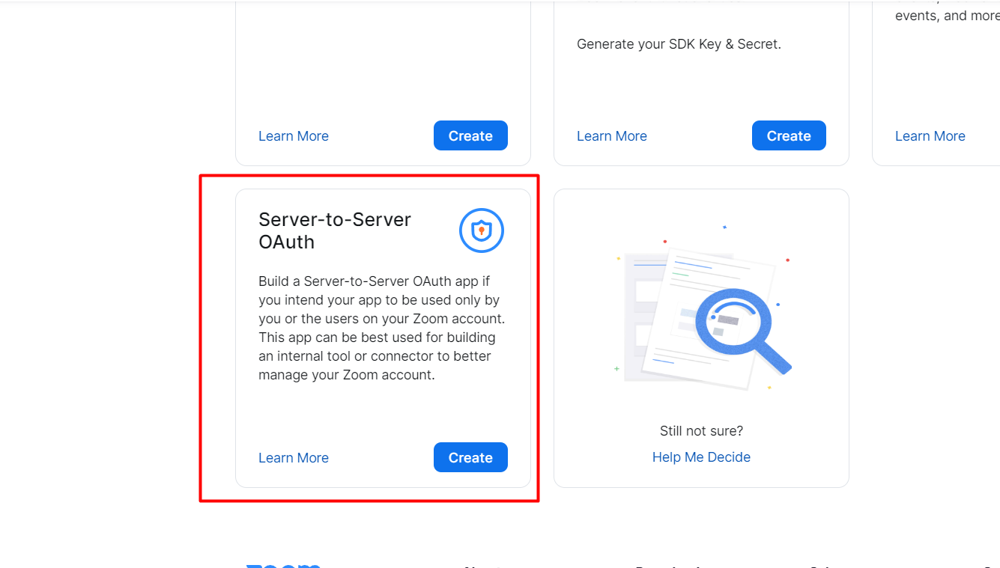
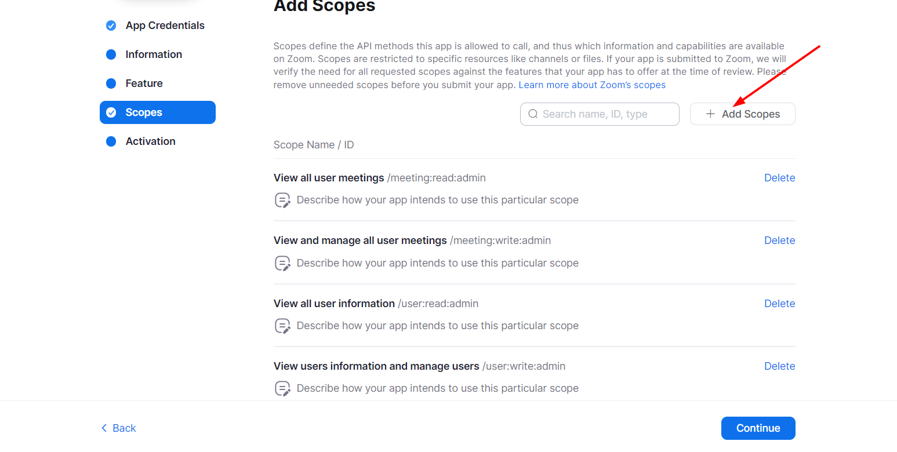
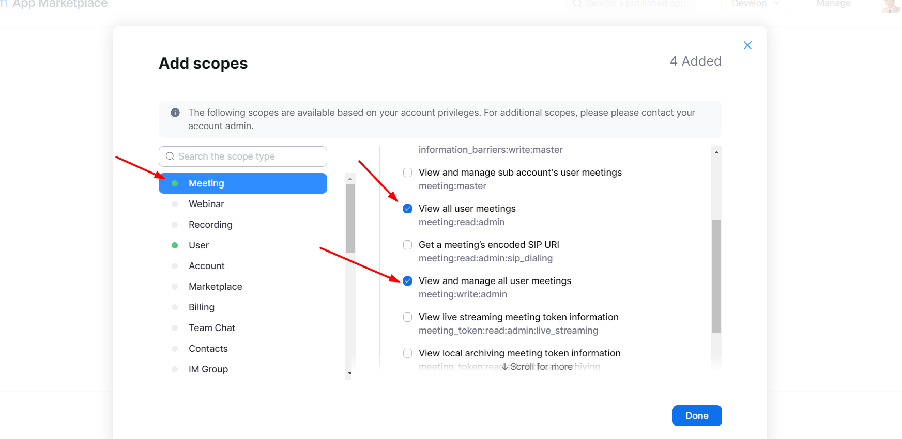

- Go to [https://marketplace.zoom.us/develop/create](https://marketplace.zoom.us/develop/create) and create a Server-to-Server OAuth app
- 
- then click on Continue
- 
- then fill up the form and click on Continue
- 
- then click on Continue
- 
- then click on Add Scopes
- 
- then mark all scopes and click on Done
- 
- 
- then click on Continue
- then activate your app
- then copy your API Key and API Secret
